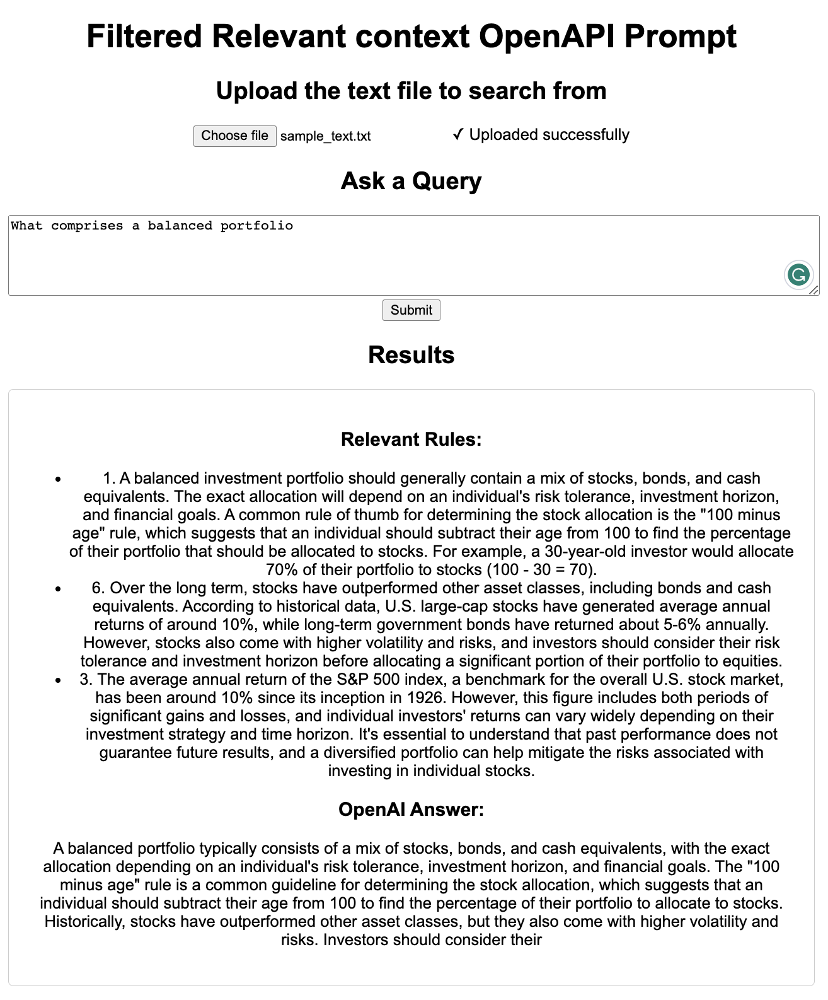

# Filtered Relevant context OpenAPI Prompt

In order to fully harness the power of Generative AI models, it is crucial to guide them towards the desired outcome. By providing a relevant context to a query, it is possible to obtain better quality results from these models.

This solution comes in handy as a simple DIY experiment, complete with a user interface that allows for inputting a large text and a query. The system then returns responses from OpenAPI, ensuring that only the relevant context is considered as the input.

The approach involves embedding the large file text using Sentence Transformers. Next, FAISS is employed to select the top N-matched data points, pass the relevant information to the OpenAI API, and ultimately return the appropriate responses. This method ensures a more efficient and accurate retrieval of information, tailored to specific needs.



## Table of Contents

1. [Getting Started](#getting-started)
    - [Prerequisites](#prerequisites)
    - [Installation](#installation)
    - [Configuration](#configuration)
2. [Usage](#usage)
3. [Project Structure](#project-structure)
4. [Further Reading](#further-reading)

## Getting Started

### Prerequisites

- Python 3.6 or higher
- Flask
- NumPy
- OpenAI
- Sentence-Transformers
- Transformers
- faiss-cpu
- An OpenAI API key (Sign up for an account at [OpenAI](https://beta.openai.com/signup/) and obtain an API key)

### Installation

1. Clone the repository:

    ```bash
    git clone https://github.com/Sreekiranar/Filtered-Relevant-context-OpenAPI-Prompt.git
    cd Filtered-Relevant-context-OpenAPI-Prompt
    ```

2. Install the required dependencies:

```bash
pip install -r requirements.txt
```

### Configuration

Update the `app.py` file with your OpenAI API key:

```bash
# Configure the OpenAI API
openai.api_key = "enter-your-api-key"
```

Replace `enter-your-api-key` with your actual OpenAI API key.

## Usage

Run the Flask app:

```bash
python app.py
```

Access the web interface via your browser:
<http://localhost:5000/>

## Project Structure

- `app.py`: The main application script that handles the Flask server, routes, and the query answering logic.
- `index.html`: The HTML template for the web interface.
- `requirements.txt`: A list of Python packages required to run the project.
- `README.md`: This documentation file.

## Further Reading

1. [Sentence Transformers](https://www.sbert.net/): Sentence Transformers is a framework for computing dense vector representations of sentences and paragraphs, based on the well-known Transformers architecture. These representations can be used for various NLP tasks, such as semantic search, clustering, and paraphrase detection.

2. [FAISS](https://github.com/facebookresearch/faiss): FAISS (Facebook AI Similarity Search) is a library developed by Facebook AI Research that provides efficient similarity search and clustering of dense vectors. FAISS can be used for various purposes, such as nearest neighbor search, vector quantization, and indexing large datasets for similarity search.

3. [OpenAI API](https://beta.openai.com/docs/): The OpenAI API allows developers to access OpenAI's powerful language models, like GPT-3 and Codex, for various natural language processing tasks, including text completion, summarization, translation, question-answering, and more. This project uses the OpenAI API to generate accurate and compact answers based on the relevant context extracted from the input text.

## License

This project is licensed under the [MIT License](https://opensource.org/license/mit/).

## ⚠️ Warning: OpenAI API Costs

Please be aware that using the OpenAI API for text generation can incur costs, as it is a paid service. To understand the pricing structure for different models, refer to the [OpenAI Pricing page](https://openai.com/pricing).

Always review the OpenAI pricing information and select a suitable model based on your usage and budget requirements. Be cautious when using the API extensively, as it may lead to unexpected charges.
